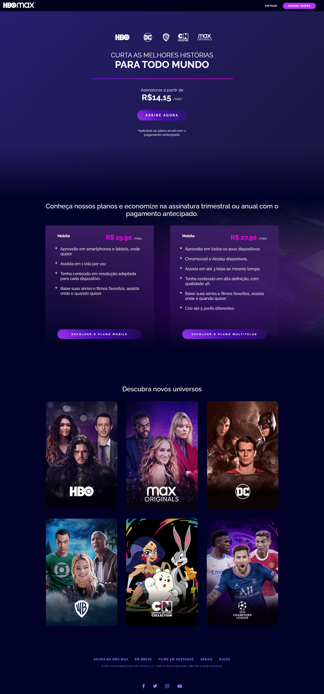
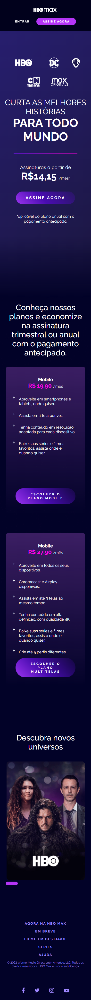

# Projeto CSS - Clone HBO Max 🎬

## 🧠 Sobre o Projeto

Este projeto foi desenvolvido durante a formação de CSS da [Dio.me](https://www.dio.me/), com foco em aplicar técnicas modernas de estilização e responsividade. O desafio consistia em recriar a interface da plataforma HBO Max, trazendo uma experiência visual envolvente e com personalidade própria.

A proposta foi aprimorada com toques personalizados no layout, efeitos visuais e adaptação para diferentes tamanhos de tela.

## ✨ Funcionalidades

- Layout responsivo para desktop e mobile  
- Animações com gradiente de fundo e botões interativos  
- Cards com efeito 3D ao passar o mouse  
- Grid com imagens que mudam no hover  
- Tela de login estilizada com validação básica  
- Barra de rolagem customizada para combinar com a identidade visual

## 💻 Tecnologias Utilizadas

- HTML5  
- CSS3 (Flexbox, Grid Layout, Media Queries, Gradientes, Animações)  
- Google Fonts: Raleway e Quicksand

## 📁 Páginas

- `index.html`: página principal com apresentação de planos e universos temáticos  
- `login.html`: tela de autenticação fictícia com formulário estilizado  
- `assets/css/`: CSS modularizado por página e estilos globais reutilizáveis

## 📸 Prévia

### Versão Desktop

  

### Versão Mobile

  

## 🙋‍♂️ Desenvolvedor

[www.linkedin.com/in/luis-fellipe-real](https://www.linkedin.com/in/luis-fellipe-real)
